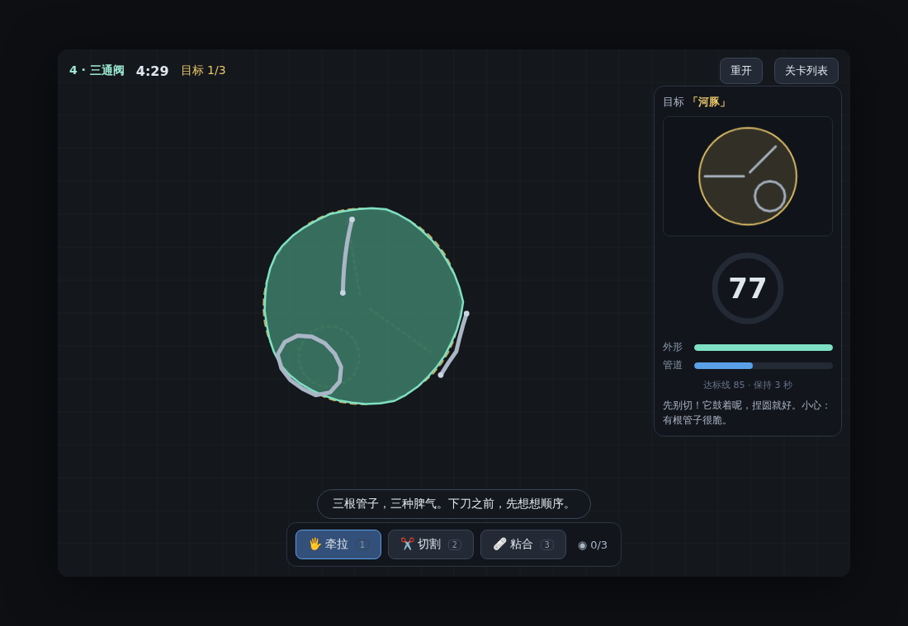
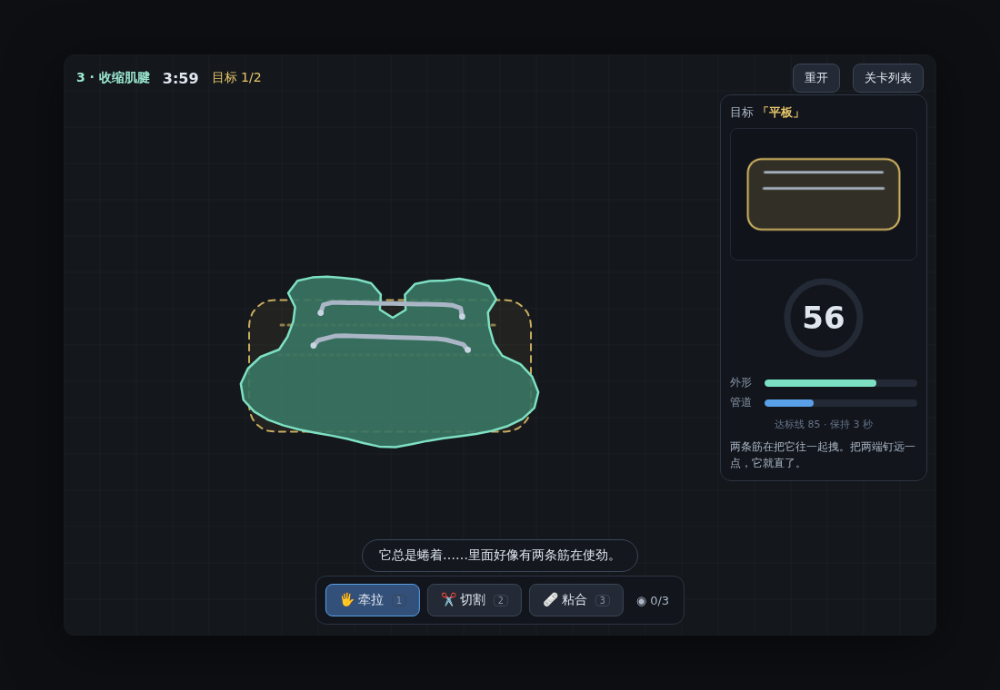
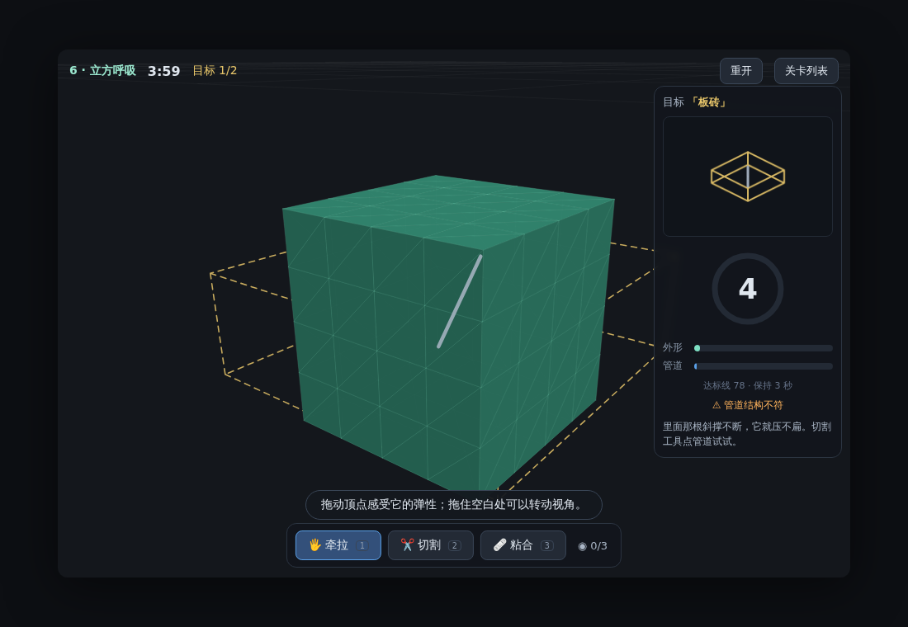

# 形变工坊 PolyForm

把一团**有脾气的软体**在几分钟内依次摆成一系列目标形状。
它内部埋着几根管道——有的硬得像骨头，有的会像肌肉一样收缩，
有的鼓着气、一剪就瘪，有的一拉就断。**它们长得一模一样。**
它的脾气，要靠你亲手试出来。



## 快速开始

纯静态网页，无构建步骤、零运行时依赖。克隆即玩：

```bash
python3 -m http.server 8080     # 或任意静态服务器（npm run serve 同效）
# 打开 http://localhost:8080
```

> 需要现代浏览器（原生 ES modules）。直接双击 index.html 不行——
> 模块加载需要 http(s) 协议。

## 玩法

- 每关给你一个软体 + 一串目标形状（右侧面板）+ 一个倒计时。
- 右侧仪表显示当前形状与目标的**实时相似度（0–100）**，
  分解为外形分与管道分；金色虚线幽灵贴着你的软体显示目标残差。
- 读值 ≥ 达标线并**保持 3 秒**（蓄力环转满）→ 该目标完成。

| 操作 | 方式 |
|------|------|
| 牵拉 | 工具 1，按住拖动（软手掌抓取一小片材料） |
| 钉住 | 双击某点固定/解除（**抓取+图钉合计最多 3 个控制点**） |
| 切割 | 工具 2，从软体**外部**划一刀：可以一分为二、切出开缝、切断管道、切开焊缝。**不可逆。** |
| 粘合 | 工具 3，按住一段边缘拖到另一段边缘松开 |
| 3D 关 | 拖顶点塑形；拖空白处转视角；切割工具**点击**管道剪断 |
| 快捷键 | `1/2/3` 换工具 · `R` 重开 · `Esc` 关卡列表 |

**提示**：切断加压管道会泄气，剪断肌腱会释放拉力——有的目标必须切，
有的目标切了就再也做不出来。下刀之前，想清楚顺序。

## 关卡

| # | 名称 | 维度 | 时限 | 主题 |
|---|------|------|------|------|
| 1 | 入门·软身 | 2D | 3:00 | 牵拉与钉住 |
| 2 | 高压水管 | 2D | 3:30 | 发现"切割泄气" |
| 3 | 收缩肌腱 | 2D | 4:00 | 对抗肌腱 / 顺势对折 + 粘合 |
| 4 | 三通阀 | 2D | 4:30 | 分阶段切割，顺序即命运 |
| 5 | 自由塑形 | 2D | 5:00 | 毕业考：捏、泄、分、粘 |
| 6 | 立方呼吸 | 3D | 4:00 | 软立方体与它的斜撑 |

## 技术

- **自研 XPBD 软体物理**（`src/engine/xpbd.js`）：粒子 + 距离/面积/体积约束，小步长求解。
- **2D 软体** = 边界环 + 内压（凝胶）+ 弹簧格架；切割/粘合是**环手术**，无需重网格化。
- **相似度** = 旋转搜索栅格 IoU（外形）+ Chamfer 距离（管道）+ 拓扑门（该切没切一票否决）。
- **3D** = 表面三角网格 + 体积约束 + 自研软件渲染器（透视投影 + 画家算法），零依赖。
- 详见 [docs/DESIGN.md](docs/DESIGN.md)（含关卡剧透与全部调参依据）。

## 开发与测试

```bash
node --test 'tests/**/*.test.js'   # 53 项单测：物理、切割、相似度、关卡审计、作者解可达性
node tests/e2e/smoke.mjs           # Playwright 冒烟（需要 playwright 与 Chromium）
```

关卡是纯数据（`src/game/levels/*.js`）。授关必须遵守两条守恒律：
目标面积 ≈ 身体面积 × 压力系数；目标周长 ≈ 轮廓周长（±10%）。
`tests/levels.test.js` 与 `tests/solve.test.js` 会机械审计每一关的可达成性。

## 截图

| 2D：收缩肌腱 | 3D：立方呼吸 |
|---|---|
|  |  |

## License

MIT
